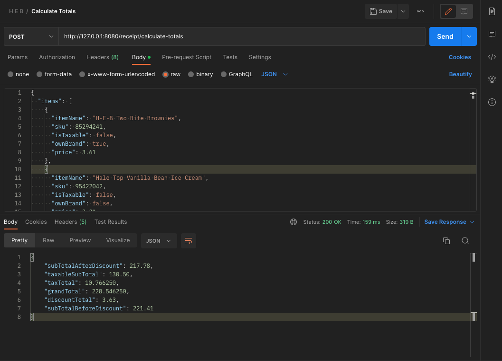
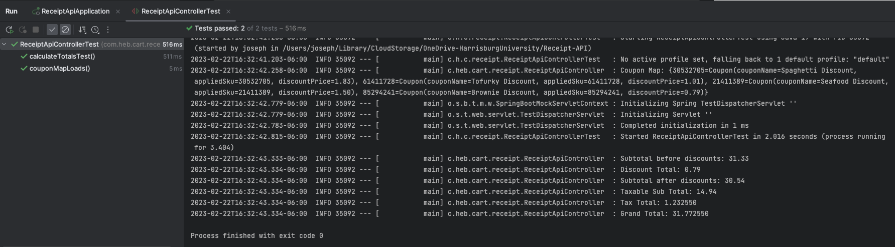

# Receipt API
This project was generated using [Spring Initializer](https://start.spring.io/)

# Getting Started
I would advise you to run this using your ide, simply clone this repository, 
and then run `ReceiptApiApplication` as a spring boot application.

To access the endpoints, postman is a good choice, create a post request with the contents of the `items.json`
file as the body to `http://127.0.0.1:8080/receipt/calculate-totals`

# Sample Results
## Postman Request

## Tests Pass

### Reference Documentation
For further reference, please consider the following sections:

* [Official Apache Maven documentation](https://maven.apache.org/guides/index.html)
* [Spring Boot Maven Plugin Reference Guide](https://docs.spring.io/spring-boot/docs/3.0.2/maven-plugin/reference/html/)
* [Create an OCI image](https://docs.spring.io/spring-boot/docs/3.0.2/maven-plugin/reference/html/#build-image)

